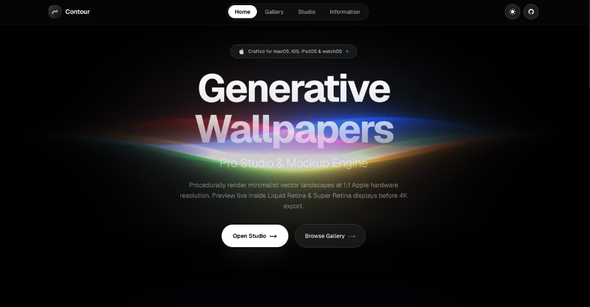
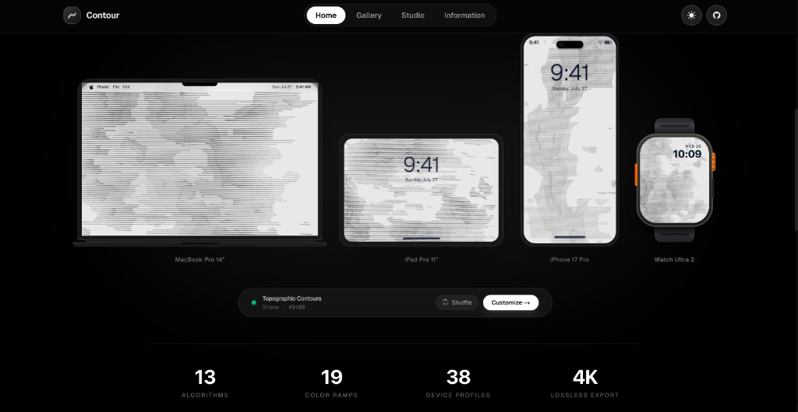
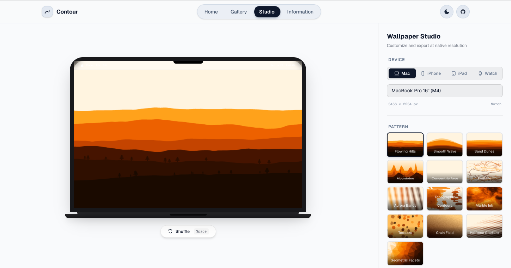
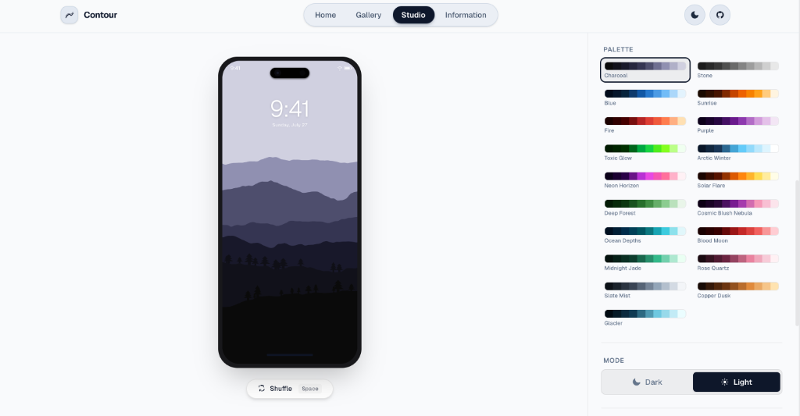
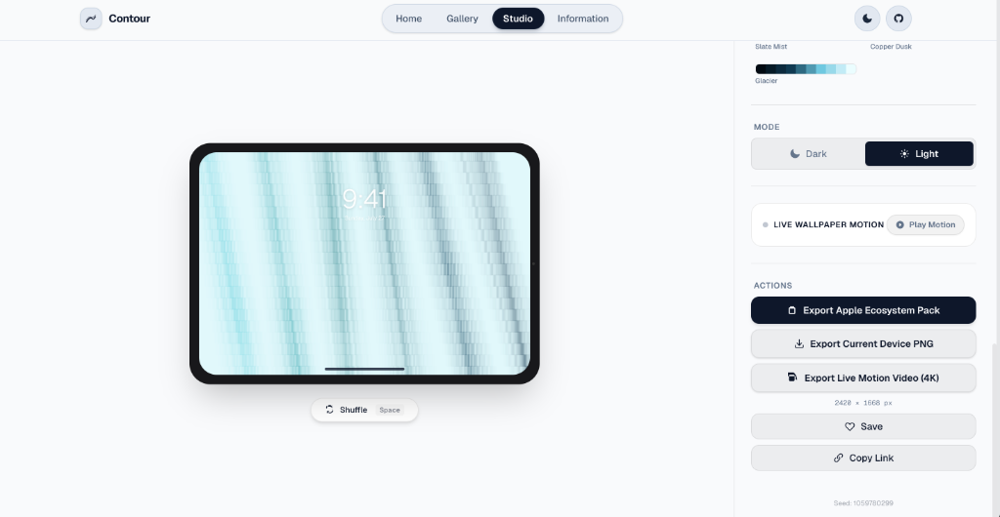
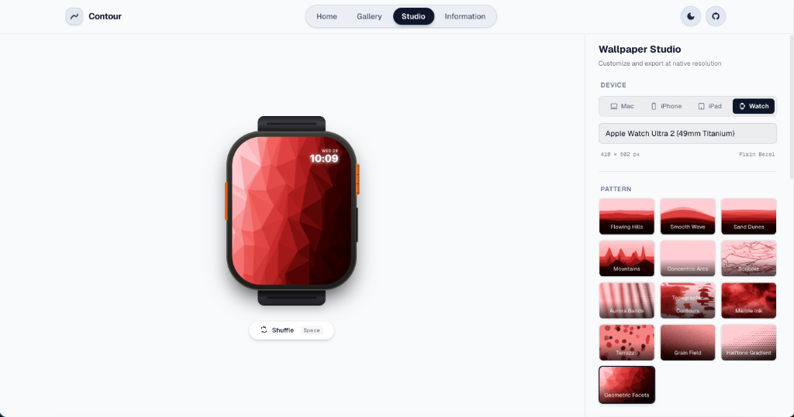
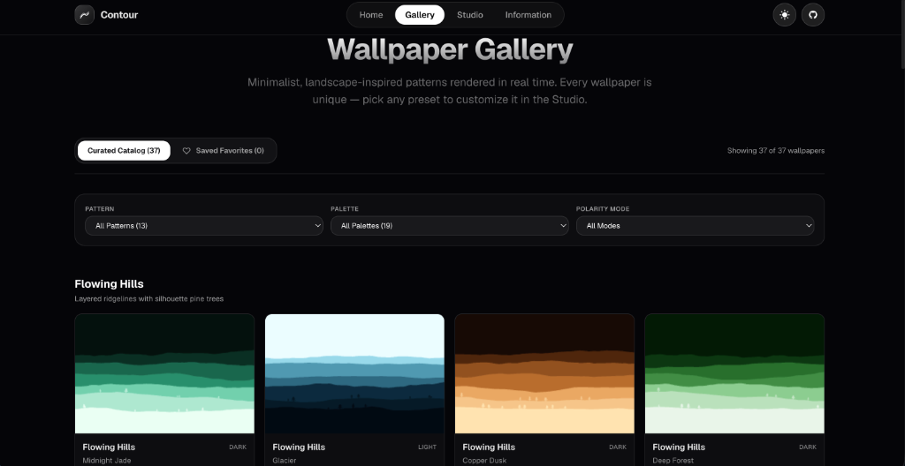
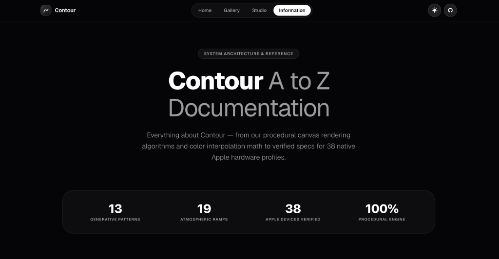

<div align="center">
  
  <h1>Contour</h1>
  <p><strong> Generative 4K Wallpaper & 60 FPS Live Motion Studio for Apple Devices</strong></p>

  [](https://nextjs.org/)
  [](https://react.dev/)
  [](https://www.typescriptlang.org/)
  [](https://tailwindcss.com/)
  [](https://github.com/satiricalguru/Contour)
  [](./LICENSE)
</div>

<br />

> **Contour** is an ultra-premium, 100% client-side generative wallpaper studio engineered specifically for the Apple ecosystem. Powered by pure mathematical algorithms (1D/2D value noise, domain-warped fractal Brownian motion, PRNG, and smooth RGB color interpolation), Contour generates bespoke 4K static wallpapers and 60 FPS live motion wallpapers directly inside your browser.

---

## 📷 Screenshots & Preview Gallery

| 🌟 Hero Showcase |  Native Apple Hardware Stage |
| :---: | :---: |
|  |  |

| 💻 MacBook Studio | 📱 iPhone 17 Pro Studio |
| :---: | :---: |
|  |  |

| 📱 iPad Pro Studio & Live Motion | ⌚ Apple Watch Ultra 2 Studio |
| :---: | :---: |
|  |  |

| 🖼️ Curated Wallpaper Gallery | 📚 System Documentation |
| :---: | :---: |
|  |  |

---

## ✨ Highlights & Features

- 🎬 **60 FPS Procedural Live Motion Engine**: Real-time canvas animation engine rendering smooth domain warping, northern lights shimmers, and undulating wave physics.
- 🍏 **Apple Ecosystem Pack Multi-Device Batch Export**: One-click batch wallpaper exporter generating native 4K wallpapers tailored to your exact Apple devices (Mac, iPhone, iPad, Watch).
- 📹 **4K Live Video Export (MP4 / WebM)**: Record 5-second seamless 4K video wallpapers directly in browser via client-side `MediaRecorder` + `Canvas.captureStream(60)`.
-  **38 Native Apple Hardware Mockup Profiles**: Pixel-accurate preview frames for MacBook Pro 16", MacBook Air, iPad Pro 13", iPhone 17 Pro, iPhone Air, Apple Watch Ultra 2, and more.
- 🎨 **13 Algorithmic Canvas Patterns**: *Flowing Hills*, *Topographic Contours*, *Aurora Bands*, *Marble Ink*, *Smooth Wave*, *Sand Dunes*, *Geometric Facets*, *Terrazzo*, *Grain Field*, *Halftone Gradient*, *Concentric Arcs*, *Mountains*, and *Scribble*.
- 🌈 **19 Handcrafted Mood Palettes**: Vibrant gradients inspired by Apple design language (*Midnight Jade*, *Pacific Blue*, *Sunset Horizon*, *Aurora Borealis*, *Neon Cyberpunk*, *Minimal Mono*, and more).
- ⚡ **Real-Time OffscreenCanvas 4K PNG Export**: Instant pixel-perfect rendering up to native 3456 × 2234 resolution without DOM freezing.
- 🔒 **100% Client-Side & Zero Backend Dependencies**: Zero database calls, zero external APIs, and zero tracking. All rendering and video exports happen locally in your browser.

---

## 🛠️ Architecture & Tech Stack

- **Framework**: [Next.js 16](https://nextjs.org/) (App Router, React 19, Turbopack)
- **Language**: [TypeScript 5](https://www.typescriptlang.org/)
- **Styling**: [Tailwind CSS v4](https://tailwindcss.com/) with CSS variables
- **State Management**: [Zustand](https://github.com/pmndrez/zustand) with persistent `localStorage`
- **Graphics Engine**: HTML5 Canvas 2D API + `OffscreenCanvas` + `MediaRecorder`
- **Testing**: [Vitest](https://vitest.dev/)

---

## 🚀 Quick Start

### Prerequisites
- [Node.js](https://nodejs.org/) (v18.0 or higher)
- `npm`, `yarn`, or `pnpm`

### Installation

1. **Clone the repository**:
   ```bash
   git clone https://github.com/satiricalguru/Contour.git
   cd Contour
   ```

2. **Install dependencies**:
   ```bash
   npm install
   ```

3. **Start the local development server**:
   ```bash
   npm run dev
   ```

4. Open [http://localhost:3000](http://localhost:3000) in your browser.

---

## ⌨️ Studio Keyboard Shortcuts

| Key | Action |
| --- | --- |
| `Space` | Instantly randomize seed & generate a new variation |
| `D` or `L` | Toggle wallpaper polarity (Dark / Light mode) |

---

## 📄 License

Distributed under the **MIT License**. See [`LICENSE`](./LICENSE) for more details.

---

<div align="center">
  <sub>Crafted with precision for Apple displays. Powered by Next.js 16 & Canvas 2D.</sub>
</div>
